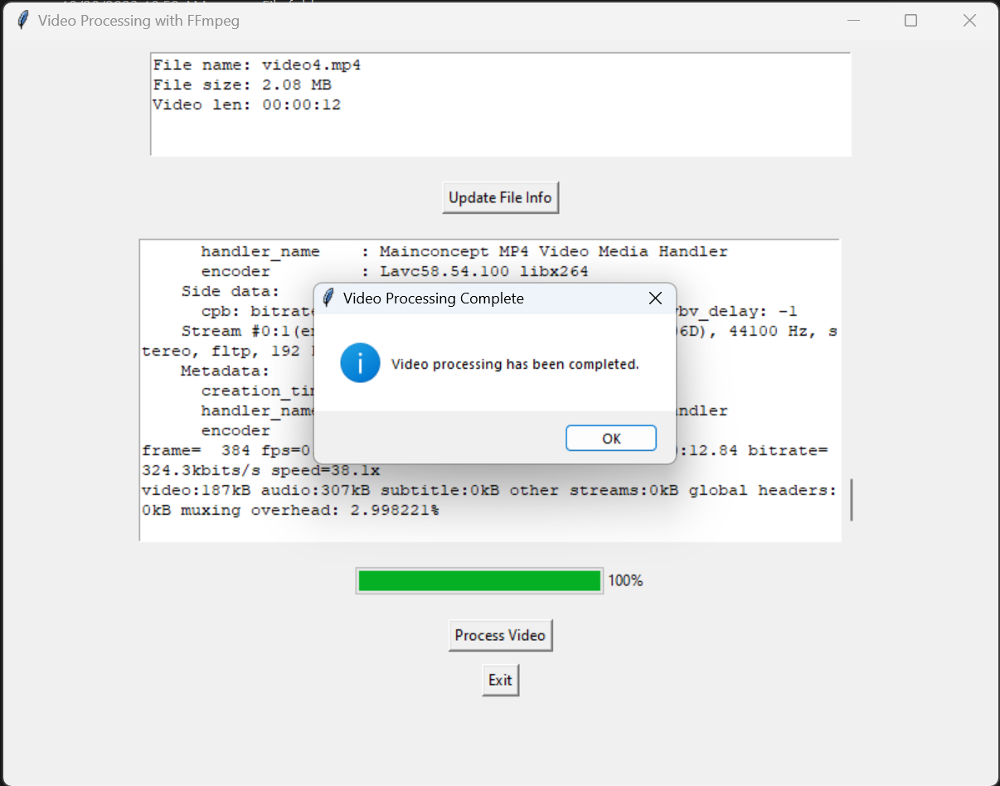

Chạy command bên dưới để build
```sh
build.bat
```

## Cách sử dụng
Sau khi build thì vào folder `dist` và chạy file `Compress Video.exe` để sử dụng

Có thể pin file này vào taskbar để dễ sử dụng, chỉ cần pin một lần duy nhất.
Sau đó chỉ cần build lại là được


# Video Processing Tool with FFmpeg



## Overview

The Video Processing Tool with FFmpeg is a user-friendly desktop application designed to simplify and enhance the video compression process using the powerful FFmpeg library. This application is ideal for users who want to reduce the file size of their videos for better storage efficiency, sharing, or playback on mobile devices.

## Features

- **📁 Easy File Selection:**
  - Effortlessly select video files through an intuitive file selection dialog.

- **ℹ️ File Information Display:**
  - View detailed information about the selected video file, including file name, size, and duration.

- **⚙️ Customizable Compression:**
  - Compress videos by scaling down the resolution with customizable settings for frame size, codec, and audio bitrate.

- **🔄 Real-time Progress Updates:**
  - Monitor the compression progress with a real-time progress bar and percentage indicator.

- **📂 Output File Management:**
  - Automatically generate compressed video files with a user-defined prefix. Overwrite existing files or move them to the recycle bin based on user preferences.

- **🚨 Error Handling:**
  - Access informative logs, including any errors that may occur during the compression process.

- **🖥️ User-Friendly Interface:**
  - Navigate the graphical user interface with ease, designed for simplicity and efficiency.

- **🔧 Multi-Platform Compatibility:**
  - Run the application on various platforms, including Windows, macOS, and Linux.

- **📦 Open Source Foundation:**
  - Leverage the FFmpeg library, ensuring a robust and open-source foundation with continuous improvements.

## Getting Started

### Prerequisites

- [FFmpeg](https://ffmpeg.org/) must be installed on your system.

- The Video Processing Tool with FFmpeg requires Python 3.7.7 or later. Here's how you can check the Python version on your system:

  ```bash
  python3 --version
  ```

  Regarding the FFmpeg version, you've provided the information. Here's the excerpt from your message:

  ```
  ffmpeg version 4.2.3 Copyright (c) 2000-2020 the FFmpeg developers
  built with gcc 9.3.1 (GCC) 20200523
  ...
  ```

  So, you have FFmpeg version 4.2.3 installed on your system. If you encounter any issues related to Python or FFmpeg versions, you may need to update or install the required versions accordingly.

### Installation

#### Windows:

##### Method 1: Using the Command Line (Chocolatey):

1. Open a command prompt as an administrator. Right-click on the Start menu and select "Command Prompt (Admin)".

2. Install Chocolatey by running the following command:

   ```powershell
   @powershell -NoProfile -ExecutionPolicy Bypass -Command "iex ((New-Object System.Net.WebClient).DownloadString('https://chocolatey.org/install.ps1'))" && SET "PATH=%PATH%;%ALLUSERSPROFILE%\chocolatey\bin"

3. Install FFmpeg with Chocolatey:

   ```bash
   choco install ffmpeg
   ```

##### Method 2: Using the GUI (ChocolateyGUI):

1. Download and install ChocolateyGUI from the official website: [ChocolateyGUI](https://chocolatey.org/packages/ChocolateyGUI).

2. Open ChocolateyGUI, search for "ffmpeg," and click the "Install" button next to the FFmpeg package.

#### macOS:

##### Method 1: Using the Command Line (Homebrew):

1. Open Terminal. If you haven't installed Homebrew, install it by running:

   ```bash
   /bin/bash -c "$(curl -fsSL https://raw.githubusercontent.com/Homebrew/install/HEAD/install.sh)"
   ```

2. Install FFmpeg with Homebrew:

   ```bash
   brew install ffmpeg
   ```

##### Method 2: Using the GUI (Homebrew Bundle):

1. Download and install Homebrew Bundle from the official website: [Homebrew Bundle](https://github.com/Homebrew/homebrew-bundle).

2. Create a `Brewfile` containing the following line:

   ```bash
   tap "homebrew/bundle"
   brew "ffmpeg"
   ```

3. Run the following command in the directory containing the `Brewfile`:

   ```bash
   brew bundle
   ```

These methods should provide users, even those less familiar with the command line, with straightforward ways to install FFmpeg on both Windows and macOS. Users can choose the method that best fits their comfort level with the command line or graphical interfaces.

## Running the Application

1. Clone the repository:

   ```bash
   git clone https://github.com/mrluaf/Compress-Video-With-FFmpeg.git
   ```

2. Navigate to the project directory:

   ```bash
   cd Compress-Video-With-FFmpeg
   ```

### Setting Up a Virtual Environment

#### Windows:

1. Open a command prompt and navigate to your project directory.

2. Create a virtual environment:

   ```bash
   python3 -m venv venv
   ```
   
3. Activate the virtual environment:

   ```bash
   .\venv\Scripts\activate
   ```

#### macOS:

1. Open Terminal and navigate to your project directory.

2. Create a virtual environment:

   ```bash
   python3 -m venv venv
   ```
   
3. Activate the virtual environment:

   ```bash
   source venv/bin/activate
   ```

### Install dependencies:

   ```bash
   pip install -r requirements.txt
   ```

### Run the application:

   ```
   python main.py
   ```

These methods should provide users, even those less familiar with the command line, with straightforward ways to install FFmpeg on both Windows and macOS. Users can choose the method that best fits their comfort level with the command line or graphical interfaces.

## How to Use the Tool

1. **Update File Info:**
   - Click on the "Update File Info" button to fetch and display information about the selected video file.
   - The information includes the video length and size.
2. **Process Video:**
   - After updating the file information, click on the "Process Video" button to initiate the compression process.
   - Wait for the process to complete.
   - A popup message saying "Video Processing Complete" will appear when the process is finished.
   - The standard output of the process is displayed in the text area.
3. **Exit Application:**
   - If you want to exit the application, click on the "Exit" button.
   - This will close the application.

That's it! Following these simple steps should allow you to update file information, compress videos, and exit the application when you're done.

## Author

- **Nguyen Van Tai**
  - [Website](https://nguyenvantai.vn) 🌐
  - [LinkedIn](https://www.linkedin.com/in/nguyenvantai/) 🔗
  - [Facebook](https://fb.com/luaacoustic) 🔗

## Contributing

We welcome contributions from the community! If you'd like to contribute to this project, please follow our [contribution guidelines](CONTRIBUTING.md).

## License

This project is licensed under the [MIT License](LICENSE).

## Acknowledgments

- The application is built on the foundation of the FFmpeg library.
